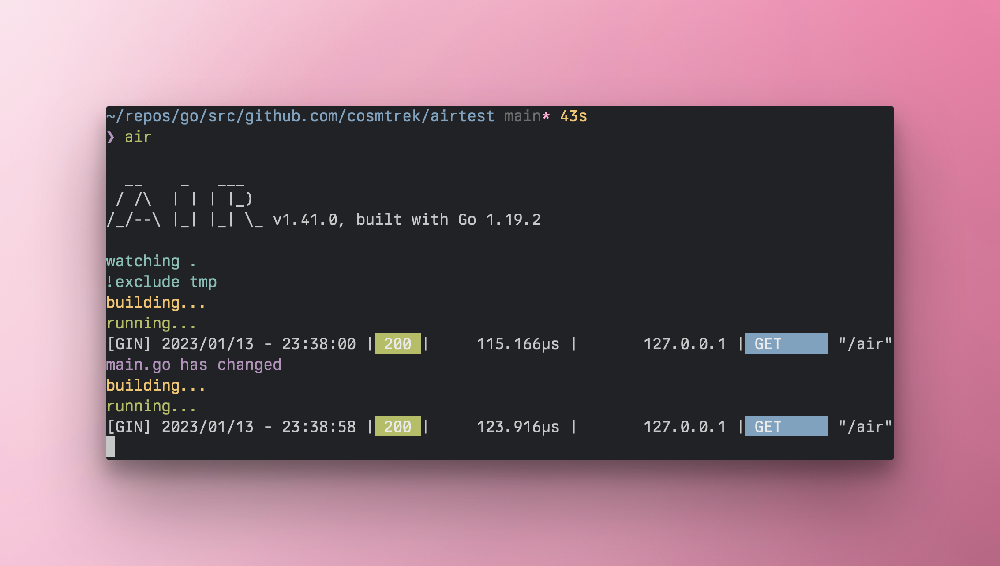

# go-grom
proyecto Go

https://github.com/JANCARLO123/go-gorm

go mod init github.com/JANCARLO123/go-gorm


# instalar 

# https://github.com/gorilla/mux 
go get -u github.com/gorilla/mux


* [Install](#install)
* [Examples](#examples)

## Install

With a [correctly configured](https://golang.org/doc/install#testing) Go toolchain:

```sh
go get -u github.com/gorilla/mux
```

## Examples

Let's start registering a couple of URL paths and handlers:

```go
func main() {
    r := mux.NewRouter()
    r.HandleFunc("/", HomeHandler)
    r.HandleFunc("/products", ProductsHandler)
    r.HandleFunc("/articles", ArticlesHandler)
    http.Handle("/", r)
}

# :cloud: Air - Live reload for Go apps




* [Install](#install )
* [Examples](#examples)


## Installation
```bash
# binary will be $(go env GOPATH)/bin/air
curl -sSfL https://raw.githubusercontent.com/cosmtrek/air/master/install.sh | sh -s -- -b $(go env GOPATH)/bin
# or install it into ./bin/
curl -sSfL https://raw.githubusercontent.com/cosmtrek/air/master/install.sh | sh -s
air -v
```

### Via `go install`

With go 1.16 or higher:

```bash
go install github.com/cosmtrek/air@latest
```

### Docker

Please pull this docker image [cosmtrek/air](https://hub.docker.com/r/cosmtrek/air).

```bash
docker run -it --rm \
    -w "<PROJECT>" \
    -e "air_wd=<PROJECT>" \
    -v $(pwd):<PROJECT> \
    -p <PORT>:<APP SERVER PORT> \
    cosmtrek/air
    -c <CONF>
```

<details>
  <summary>For example</summary>

One of my project runs in docker:

```bash
docker run -it --rm \
    -w "/go/src/github.com/cosmtrek/hub" \
    -v $(pwd):/go/src/github.com/cosmtrek/hub \
    -p 9090:9090 \
    cosmtrek/air
```
</details>


# :The fantastic ORM library for Golang aims to be developer friendly.
https://gorm.io/docs/

* [Install](#install )
* [Examples](#examples)


## Installation

### Via `go install`


### `gorm`
```bash
go get -u gorm.io/gorm

```
### Via `drives`
```bash

go get -u gorm.io/driver/sqlite
go get -u gorm.io/driver/mysql
go get -u gorm.io/driver/postgres
go get -u gorm.io/driver/sqlserver

```


<details>
  <summary>For example</summary>

One of my project runs in docker:

```bash

package main

import (
  "gorm.io/gorm"
  "gorm.io/driver/sqlite"
)

type Product struct {
  gorm.Model
  Code  string
  Price uint
}

func main() {
  db, err := gorm.Open(sqlite.Open("test.db"), &gorm.Config{})
  if err != nil {
    panic("failed to connect database")
  }

  // Migrate the schema
  db.AutoMigrate(&Product{})

  // Create
  db.Create(&Product{Code: "D42", Price: 100})

  // Read
  var product Product
  db.First(&product, 1) // find product with integer primary key
  db.First(&product, "code = ?", "D42") // find product with code D42

  // Update - update product's price to 200
  db.Model(&product).Update("Price", 200)
  // Update - update multiple fields
  db.Model(&product).Updates(Product{Price: 200, Code: "F42"}) // non-zero fields
  db.Model(&product).Updates(map[string]interface{}{"Price": 200, "Code": "F42"})

  // Delete - delete product
  db.Delete(&product, 1)
}

```
</details>


